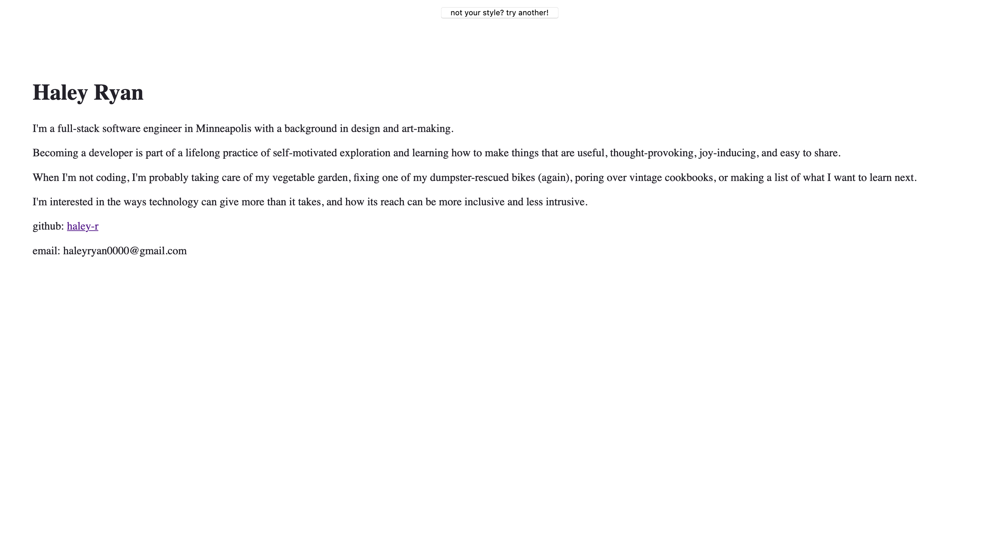
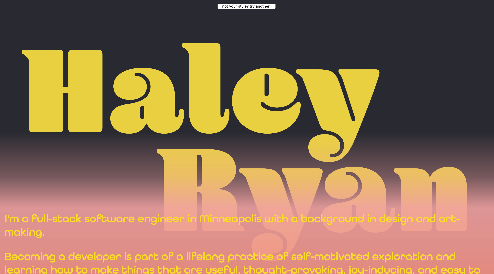
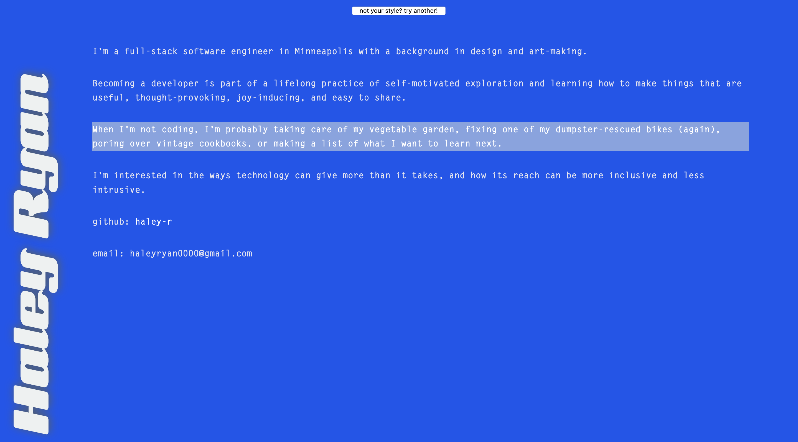
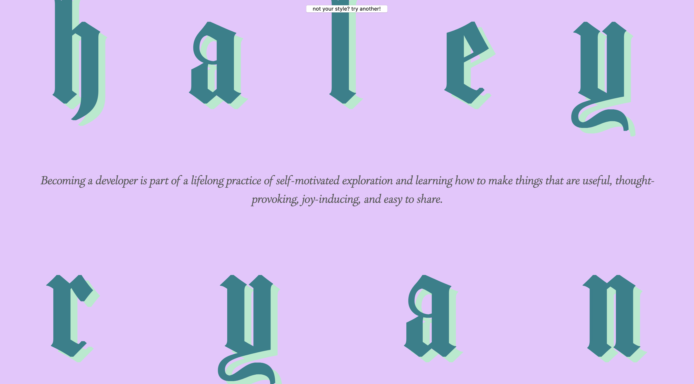
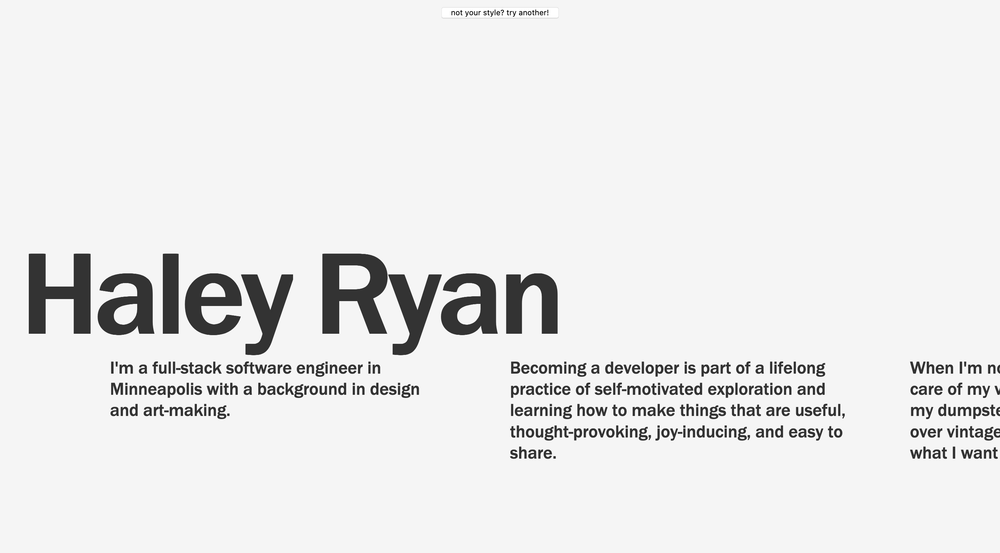
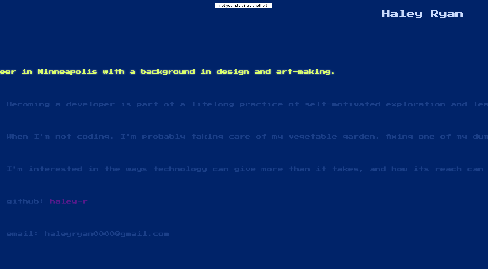

A simple css site built with Gatsby and hosted with Netlify.

To see code locally at localhost:8000, navigate to repository folder with a terminal and run "npm start"

Live version at [haleyr.info](https://haleyr.info)

### Screenshots

